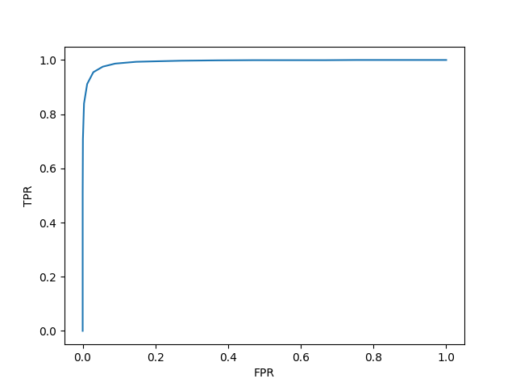
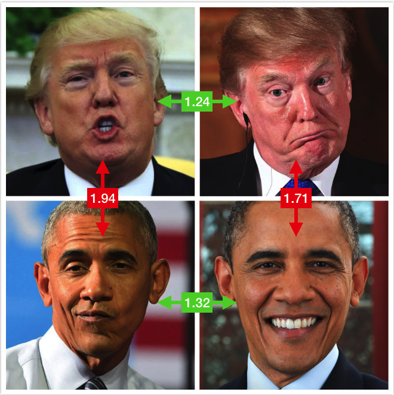

# center-loss.pytorch
Center loss implementation for face recognition in pytorch. Paper at: [A Discriminative Feature Learning Approach
for Deep Face Recognition](https://ydwen.github.io/papers/WenECCV16.pdf)

## Requirements

* Python 3.6
* Pytorch 0.4

## Usage

**Training** No need to download anything. The following command will create directorys and download everything automatically.

```
python3 main.py
```

**Evaluation**

```
python3 main.py --evaluate ./logs/models/epoch_xx.pth.tar
```

**More Options**

```
python3 main.py -h
```

```
usage: main.py [-h] [--batch_size N] [--log_dir LOG_DIR] [--epochs N]
               [--lr LR] [--resume RESUME] [--dataset_dir DATASET_DIR]
               [--weights WEIGHTS] [--evaluate EVALUATE] [--pairs PAIRS]
               [--roc ROC]

center loss example

optional arguments:
  -h, --help            show this help message and exit
  --batch_size N        input batch size for training (default: 256)
  --log_dir LOG_DIR     log directory
  --epochs N            number of epochs to train (default: 30)
  --lr LR               learning rate (default: 0.001)
  --resume RESUME       model path to the resume training
  --dataset_dir DATASET_DIR
                        directory with lfw dataset (default:
                        $HOME/datasets/lfw)
  --weights WEIGHTS     pretrained weights to load
  --evaluate EVALUATE   evaluate specified model on lfw dataset
  --pairs PAIRS         path of pairs.txt (default: $DATASET_DIR/pairs.txt)
  --roc ROC             path of roc.png to generated (default:
                        $DATASET_DIR/roc.png)
```

## Result

Training for 50 epochs and then evaluate the model.

```
Model accuracy is 0.8972221612930298
ROC curve generated at /home/louis/center-loss.pytorch/logs/roc.png
```




## Random People Verification

2 images of Obama and 2 images of Trump. Verify 6 pairs together.

```shell
python main.py --verify-model logs/models/epoch_50.pth.tar --verify-images images/obama_a.png,images/obama_b.png # distance: 1.322437763214111
python main.py --verify-model logs/models/epoch_50.pth.tar --verify-images images/trump_a.png,images/trump_b.png # distance: 1.245901346206665

python main.py --verify-model logs/models/epoch_50.pth.tar --verify-images images/obama_a.png,images/trump_a.png # distance: 1.967863798141479
python main.py --verify-model logs/models/epoch_50.pth.tar --verify-images images/obama_a.png,images/trump_b.png # distance: 1.942347526550293
python main.py --verify-model logs/models/epoch_50.pth.tar --verify-images images/obama_b.png,images/trump_a.png # distance: 1.716896772384643
python main.py --verify-model logs/models/epoch_50.pth.tar --verify-images images/obama_b.png,images/trump_b.png # distance: 1.445886135101318
```



We can see that threshold of 1.4 will perfectly seperate them.

Due to the small dataset and small feature extract network, this model is just for quick example reference. If one wants to use in production, change the feature extract network and train on a larger dataset.